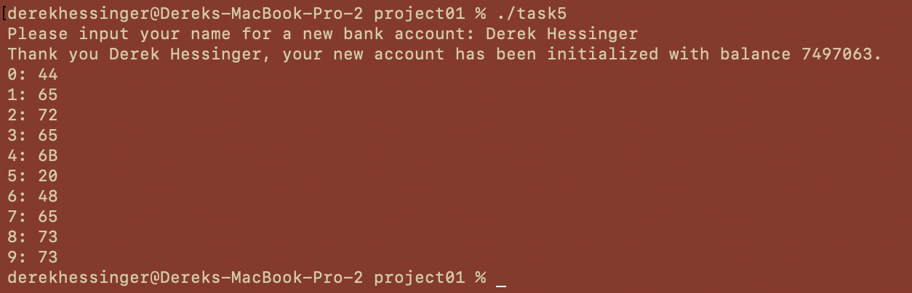

# Project 1 Derek Hessinger 9/18/2024

## Google Sites report: https://sites.google.com/colby.edu/dereks-cs333-site/home/project-1

## Directory tree
```
.
├── README.md
├── extensions
│   ├── extension_1
│   └── extension_1.c
├── media
│   ├── task1.png
│   ├── task2.png
│   ├── task3a.png
│   ├── task3b.png
│   ├── task4.png
│   ├── task4b.jpeg
│   └── task5.png
├── task1
├── task1.c
├── task2
├── task2.c
├── task3
├── task3.c
├── task4
├── task4.c
├── task5
└── task5.c
```

## Operating System and C compiler
OS: Apple Sonoma \
C compiler: Apple clang version 15.0.0 (clang-1500.3.9.4), Target: arm64-apple-darwin23.5.0, Thread model: posix

## Task 1
Compile the program with ```gcc -o task1 task1.c```\
Run program with ```./task1```\
There are no known bugs with the program\
Output:\

Answers:
- The machine I am using is Little Endian.
- I know that the machine I am using is Little Endian because as seen in the long, float, and double values, the numbers are stored by the least significant bit first, which matches the definition of Little Endian.


## Task 2
Compile the program with ```gcc -o task2 task2.c```\
Run program with ```./task2```\
There are no known bugs with the program\
Output:\

Answers:
- There seems to be something random stored at first, and then the variables I assigned begin at line 24 and follow every few lines after. The variables are stored as long, int, short, char, which is the reverse order of how I declared the variables in my program.
- There are a few instances where there are about 3-4 consecutive lines of values that are not my declared variables. I’m not sure what these values represent, but some of them changed when I increased my variable values by 1 to determine where they were stored in memory. 
-  I can find 4 of the 6 variables I created. I found them by assigning all of the values to numbers 1-12 so each respective number would be printed out, wrote down which lines had the corresponding variable numbers, then changed the values of the variables to increase by one and checked to see which lines had increased by one, which indicated that the corresponding lines was associated with one of the variables created. The variables I created are stored on lines 24, 32, 36, 39, 56, 64, 68, and 71.


## Task 3
Compile the program with ```gcc -o task3 task3.c```\
Run program with ```./task3```\
There are no known bugs with the program\
Output:\


Answers:
- When running the program without “free”, the program continuously assigns pointers to memory locations, causing high amounts of memory to become used very fast. This is why the program spikes on the activity monitor, since it is endlessly allocating space for pointers as fast as the processor can (seen in first image above). When using the “free” method, the pointer is released before the loop finishes each iteration, so only one pointer is holding a memory location per iteration during the program (seen in second image above).

## Task 4
Compile the program with ```gcc -o task4 task1.c```\
Run program with ```./task4```\
There are no known bugs with the program\
Output:\

Answers:
- The sizeof function prints out with a size of 12. This does not match with what I was expecting since I originally thought that the struct would only require 9 bytes, since that is the minimum number required to store each of the variables. However, as we learned in class, the compiler for C will allocate an amount of memory that is a multiple of the largest data structure stored within the structure. In this case, it is the int type, and therefore allocates 12 bytes since 4*3 = 12, which is the lowest factor of 4 that encapsulates the minimum necessary size of the struct. 
- There are some gaps in memory. For instance, there is an arbitrary value stored between the second char and second short values in the first trial. I believe this occurs because of the struct being allocated more space than neccessary, and therefore the value stored at the arbitrary memory location may be an older value not specifically generated by the program.
- Drawing pictured below:


## Task 5
Compile the program with ```gcc -o task5 task1.c```\
Run program with ```./task5```\
There are no known bugs with the program\
Output:\

Answers:
- The string I found that doesn’t work is Derek Hessinger
- The reason that the code executes this way is because the struct is defined where the variable “name” is initialized as an array with 10 elements. When a string is passed that is greater than 10 elements, the program cannot store all of the letters in the string in the “name” variable and there is overflow. Since the next defined variable is “balance”, the overflow is stored into “balance”, which is why the value changes from 0 to another number for some strings.

## Extensions

For my extensions, I completed extensions 2 and 5

## Extension 2

For this extension, I wrote a program in C that searched for a number that when added by 1, returns itself. I did this by writing a loop that tries adding 1 to every floating point value possible, and breaks/prints the number if it meets the criteria. I did this because we discussed in class how floats in C are stored in a way such that with very large numbers, this phenomena happens due to floating point precisions.

## Extension 5

For this extension, I researched a fourth language in part 2 of the project. The language I chose to explore further on was Ruby. Ruby is a popular programming language that was developed in 1996 as both a functional and imperative programming language. It has gained popularity due to its robust design and capabilities in web development. 